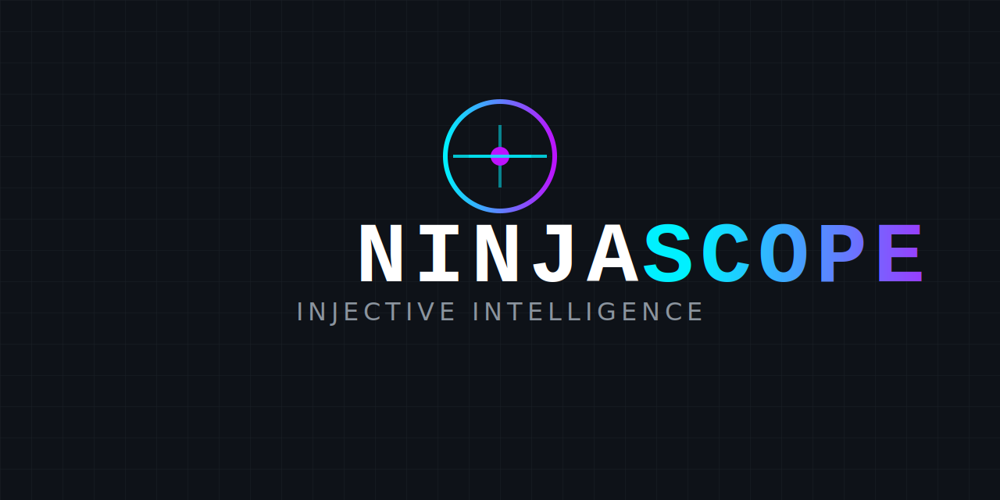
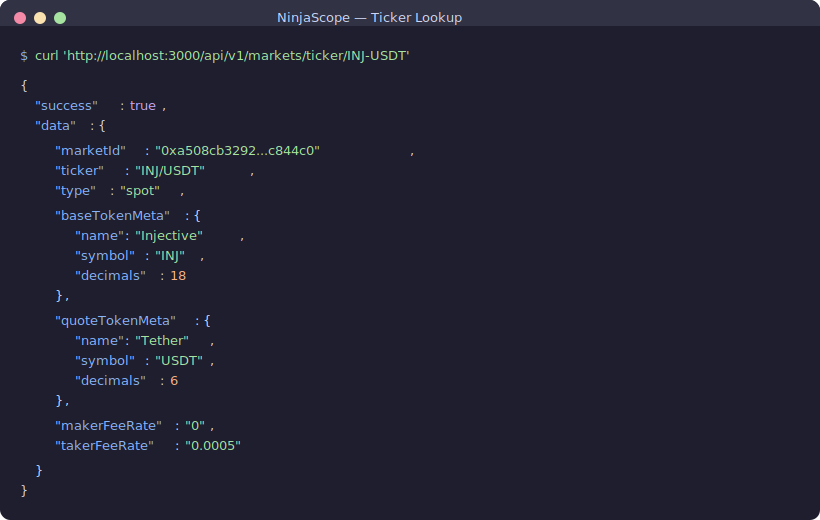
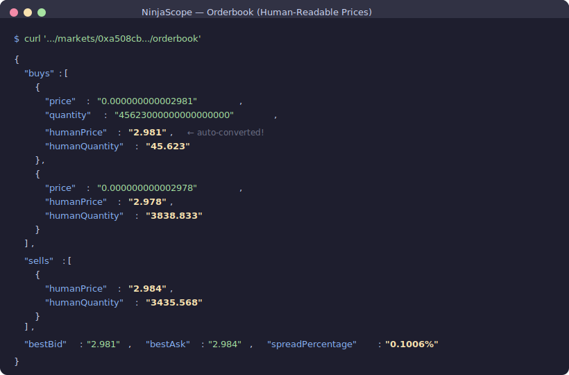
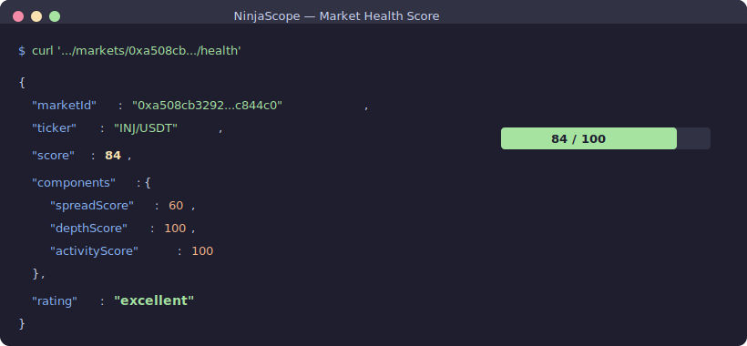
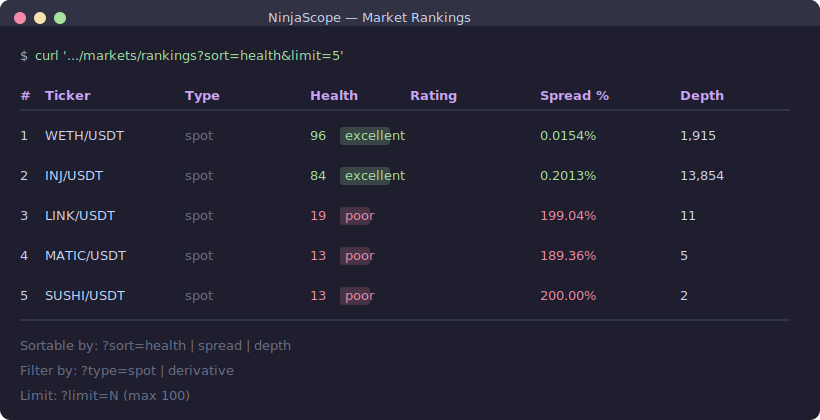
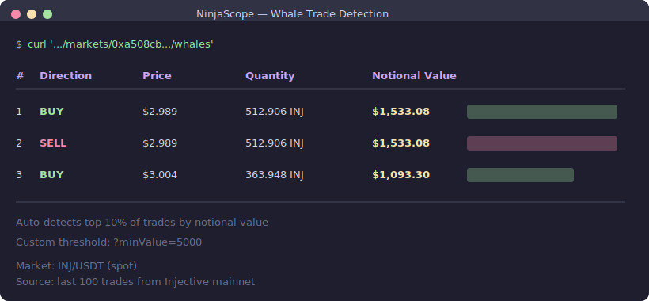
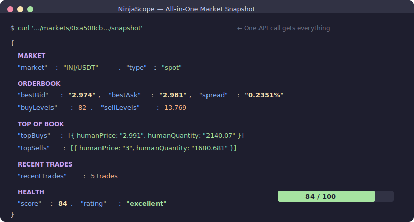
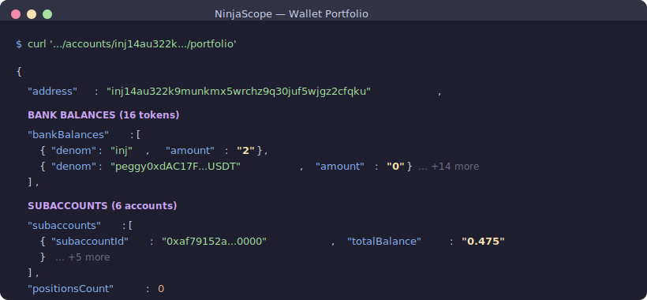

# 🥷 NinjaScope

> **See every market move before it happens.**

<p align="center">
  
</p>

**NinjaScope** is a powerful REST API that transforms Injective's raw on-chain data into developer-ready intelligence. It aggregates markets, computes real-time analytics, ranks market health, detects whale activity, and profiles wallets — all through **20 clean JSON endpoints** with automatic caching and interactive Swagger docs.

Built for the **[Ninja API Forge](https://www.hackquest.io/hackathons/Ninja-API-Forge)** hackathon.

---

## The Problem

Building on Injective means dealing with:

- **Complex gRPC/protobuf protocols** — not developer-friendly
- **Raw decimal formats** — prices like `0.000000000003078` instead of `$3.078`
- **Scattered data across multiple indexer APIs** — spot, derivatives, oracle, accounts
- **No computed analytics** — no health scores, no whale detection, no market rankings

## The Solution

NinjaScope wraps all of this into one simple API:

```bash
# Before: Deal with gRPC, protobuf, decimal math, multiple API clients...
# After:
curl http://localhost:3000/api/v1/markets/ticker/INJ-USDT
```

Returns clean, structured JSON with human-readable prices — ready for trading bots, dashboards, or DeFi apps.

---

## Hackathon Tracks Covered

| Track | What NinjaScope Delivers |
|-------|--------------------------|
| **Data Aggregation** | 200+ markets, orderbooks, trades, oracle prices, wallet portfolios — all normalized to JSON with human-readable prices |
| **Computed / Derived Data** | Spread analysis, orderbook depth, volatility, composite health scores (0-100), market rankings, whale trade detection |
| **Developer Utility** | Ticker-based lookup (no hex hashes), multi-market compare, all-in-one snapshots, intelligent caching, Swagger docs |

---

## Quick Start

```bash
git clone https://github.com/anhfactor/ninja-scope.git
cd ninja-scope
npm install
cp .env.example .env
npm start
```

API: `http://localhost:3000/api/v1` | Docs: `http://localhost:3000/docs`

---

## All 20 API Endpoints

**Base URL:** `http://localhost:3000/api/v1`

### 📊 Core Data (6 endpoints)

| Method | Endpoint | Description |
|--------|----------|-------------|
| `GET` | `/markets` | All spot + derivative markets (~200 on mainnet) |
| `GET` | `/markets/ticker/:ticker` | Lookup by human-readable ticker (`INJ-USDT`, `?type=derivative`) |
| `GET` | `/markets/:marketId` | Single market detail with token metadata |
| `GET` | `/markets/:marketId/orderbook` | Full orderbook with human-readable prices & quantities |
| `GET` | `/markets/:marketId/trades` | Recent trades with pagination (`?limit=20&skip=0`) |
| `GET` | `/oracle/prices` | All oracle price feeds (`?symbol=INJ` to filter) |

### 📈 Computed Analytics (5 endpoints)

| Method | Endpoint | Description |
|--------|----------|-------------|
| `GET` | `/markets/:marketId/spread` | Bid-ask spread, spread %, mid price |
| `GET` | `/markets/:marketId/depth` | Orderbook depth at 1%, 2%, 5%, 10% price levels |
| `GET` | `/markets/:marketId/volatility` | Volatility via log-return standard deviation |
| `GET` | `/markets/:marketId/health` | Composite health score (0-100) with component breakdown |
| `GET` | `/markets/:marketId/funding` | Funding rate history (derivatives only) |

### 🏆 Market Rankings & Signals (4 endpoints)

| Method | Endpoint | Description |
|--------|----------|-------------|
| `GET` | `/markets/rankings` | Rank all markets by health, spread, or depth |
| `GET` | `/markets/compare?ids=X,Y` | Side-by-side comparison of up to 5 markets |
| `GET` | `/markets/:marketId/whales` | Detect large trades (auto top-10% or custom `?minValue=`) |
| `GET` | `/markets/:marketId/snapshot` | All-in-one: market + orderbook + trades + health + spread |

### 👛 Wallet Intelligence (2 endpoints)

| Method | Endpoint | Description |
|--------|----------|-------------|
| `GET` | `/accounts/:address/portfolio` | Bank balances, subaccounts, open position count |
| `GET` | `/accounts/:address/positions` | Open derivative positions with unrealized PnL |

### 🔧 Developer Utility (3 endpoints)

| Method | Endpoint | Description |
|--------|----------|-------------|
| `GET` | `/markets/summary` | Aggregated stats across all markets |
| `GET` | `/markets/search?q=` | Search by ticker, base/quote denom, or symbol |
| `GET` | `/status` | API health, cache hit rate, uptime |

> **Interactive Docs:** Visit `http://localhost:3000/docs` for full Swagger UI

---

## Live Examples (Real Mainnet Data)

### 1. Find a market by ticker — no hex hashes needed

<p align="center">
  
</p>

For derivatives, add `?type=derivative`:
```bash
curl 'http://localhost:3000/api/v1/markets/ticker/BTC-USDT?type=derivative'
# → { ticker: "BTC/USDT PERP", type: "derivative", ... }
```

### 2. Orderbook with human-readable prices

Raw Injective prices like `0.000000000002990` are automatically converted to `$2.99`:

<p align="center">
  
</p>

### 3. Market health score — composite 0-100 rating

Health is computed from 3 weighted factors: spread tightness (40%), orderbook depth (30%), and recent trade activity (30%).

<p align="center">
  
</p>

### 4. Market rankings — find the best markets instantly

<p align="center">
  
</p>

### 5. Whale trade detection

Automatically surfaces the top 10% of trades by notional value:

<p align="center">
  
</p>

### 6. All-in-one market snapshot

Get everything about a market in **one API call** — perfect for dashboards:

<p align="center">
  
</p>

### 7. Wallet portfolio

<p align="center">
  
</p>

### 8. Compare markets side-by-side

```bash
curl 'http://localhost:3000/api/v1/markets/compare?ids=0xa508cb...,0x9b9980...'
```

Returns spread, depth, health, and volatility for each market in parallel — great for building comparison tools or arbitrage bots.

### 9. More examples

```bash
# Search by keyword
curl 'http://localhost:3000/api/v1/markets/search?q=btc'

# Filter by market type
curl 'http://localhost:3000/api/v1/markets?type=spot'

# Orderbook depth analysis
curl 'http://localhost:3000/api/v1/markets/0xa508cb.../depth'

# Funding rates (derivatives)
curl 'http://localhost:3000/api/v1/markets/0x9b9980.../funding'

# Open derivative positions for a wallet
curl 'http://localhost:3000/api/v1/accounts/inj1.../positions'

# API status & cache hit rate
curl 'http://localhost:3000/api/v1/status'
```

---

## Response Format

Every endpoint returns a consistent JSON envelope:

```json
{
  "success": true,
  "data": { "..." },
  "meta": {
    "cached": true,
    "timestamp": "2026-02-13T04:35:04.762Z",
    "took_ms": 0
  }
}
```

- **`meta.cached`** — `true` if served from cache, `false` if fetched fresh from Injective
- **`meta.took_ms`** — response time (cached responses are near-instant at 0ms)
- Error responses include a structured `error.code` + `error.message`

---

## Architecture & Design

### Key Design Decisions

| Decision | Why |
|----------|-----|
| **Human-readable prices** | Orderbooks and trades include `humanPrice` / `humanQuantity` — converts `0.000000000002990` → `$2.99` using token decimals |
| **Ticker-based lookup** | `/markets/ticker/INJ-USDT` instead of memorizing `0xa508cb...` hex hashes |
| **Intelligent caching** | Per-type TTLs: 5s orderbook, 10s trades, 30s analytics. `meta.cached` tells clients if data is fresh |
| **Composite health score** | Weighted formula: spread (40%) + depth (30%) + activity (30%) → 0-100 score with letter rating |
| **Auto whale detection** | Automatically finds top 10% trades by notional value — or use a custom `?minValue=` threshold |
| **One-call snapshots** | `/snapshot` endpoint aggregates market + orderbook + trades + health + spread in a single request |
| **Graceful shutdown** | `SIGINT`/`SIGTERM` handlers for clean process management |

### Injective SDK Integration

NinjaScope uses the official [Injective TypeScript SDK](https://github.com/InjectiveLabs/injective-ts) (`@injectivelabs/sdk-ts`):

| SDK Client | Used For |
|------------|----------|
| `IndexerGrpcSpotApi` | Spot markets, orderbooks, trades |
| `IndexerGrpcDerivativesApi` | Derivative markets, orderbooks, trades, funding rates, positions |
| `IndexerGrpcOracleApi` | Oracle price feeds |
| `IndexerGrpcAccountPortfolioApi` | Wallet portfolio, bank balances, subaccounts |

All data is fetched from **Injective mainnet** by default (configurable via `.env`).

### Project Structure

```
src/
├── index.ts              # Fastify entry point + graceful shutdown
├── config.ts             # Network, port, cache TTL configuration
├── plugins/
│   ├── swagger.ts        # OpenAPI/Swagger docs setup
│   └── cache.ts          # In-memory cache layer with hit tracking
├── services/
│   ├── injective.ts      # SDK client singleton
│   ├── markets.ts        # Market data, ticker lookup, decimal info
│   ├── orderbook.ts      # Orderbook + human-readable price conversion
│   ├── trades.ts         # Trade history + human-readable prices
│   ├── oracle.ts         # Oracle price feeds
│   ├── analytics.ts      # Spread, depth, volatility, health, rankings, whales, snapshots
│   └── account.ts        # Wallet portfolio + derivative positions
├── routes/
│   ├── markets.ts        # Market data + analytics + rankings (18 endpoints)
│   ├── oracle.ts         # Oracle routes (1 endpoint)
│   ├── account.ts        # Wallet routes (2 endpoints)
│   └── status.ts         # Status route (1 endpoint)
└── utils/
    ├── decimals.ts       # Spot/derivative decimal conversion utilities
    └── response.ts       # Standardized response wrapper
```

---

## Tech Stack

| Component | Technology |
|-----------|------------|
| **Runtime** | Node.js + TypeScript |
| **Framework** | [Fastify](https://fastify.dev/) (high-performance Node.js web framework) |
| **Data Source** | [@injectivelabs/sdk-ts](https://www.npmjs.com/package/@injectivelabs/sdk-ts) (official Injective SDK) |
| **Caching** | [node-cache](https://www.npmjs.com/package/node-cache) (in-memory with TTL) |
| **API Docs** | [@fastify/swagger](https://github.com/fastify/fastify-swagger) + Swagger UI |

---

## Configuration

Edit `.env` to configure:

```env
# Network: mainnet or testnet
NETWORK=mainnet

# Server
PORT=3000
HOST=0.0.0.0
```

### Development Mode (auto-reload)

```bash
npm run dev
```

---

## License

MIT
